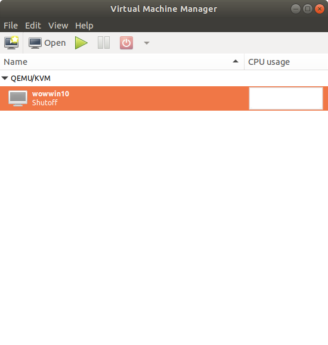
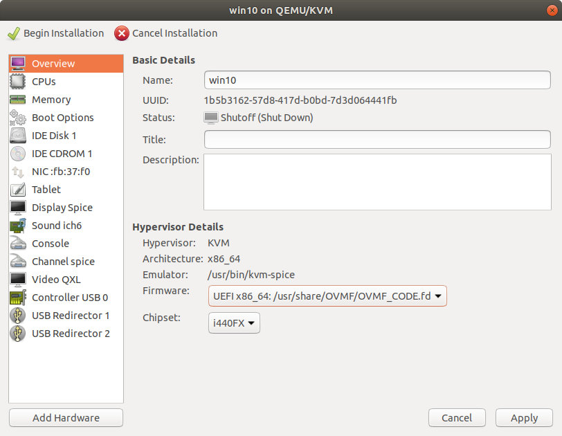
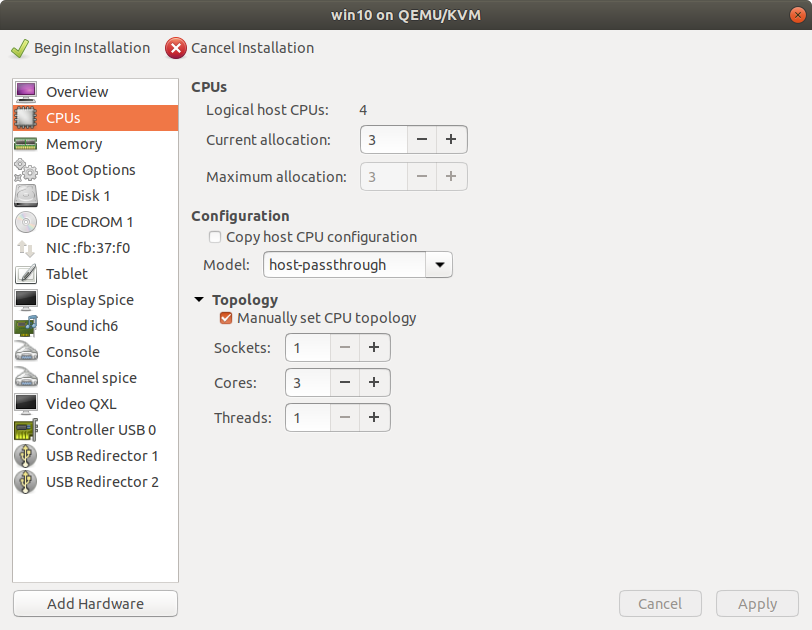
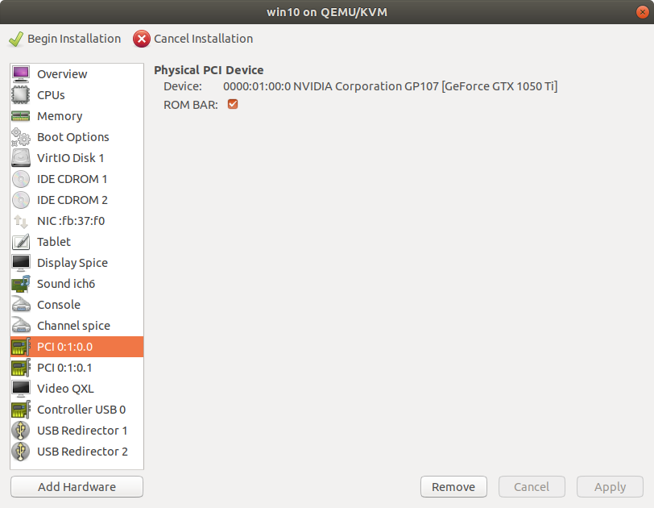
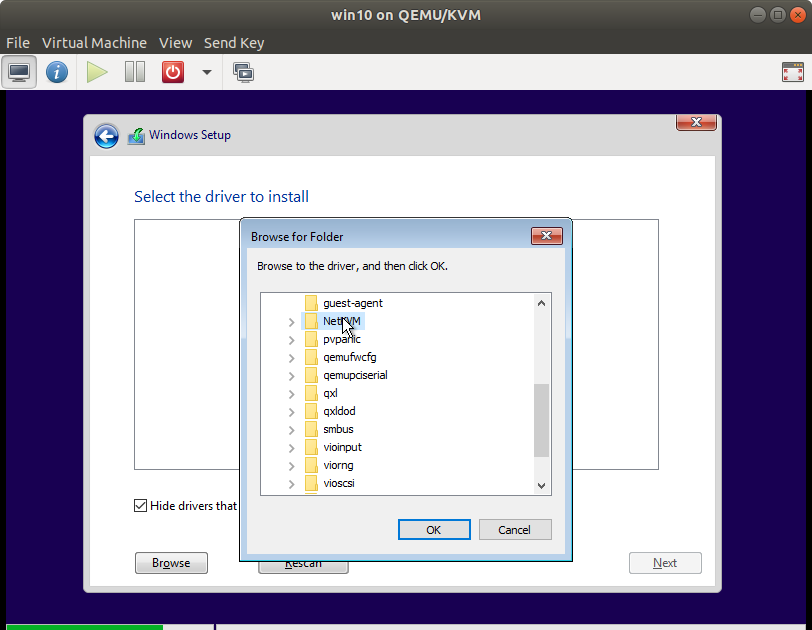
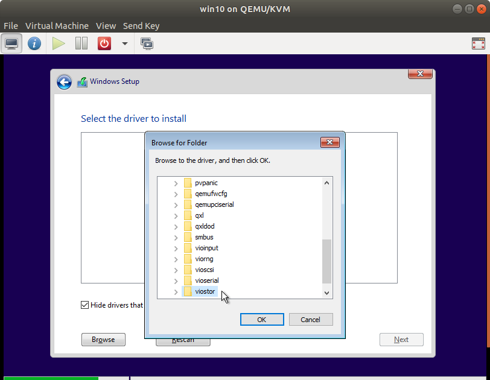
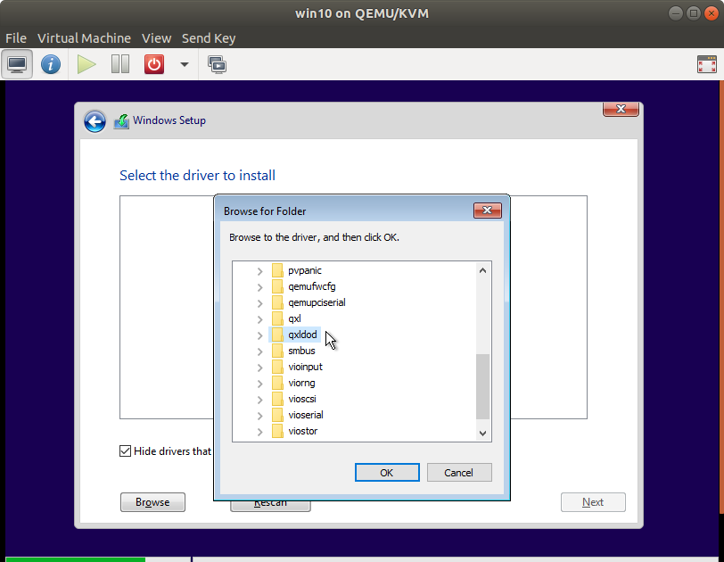

<!-- permalink: ba509ba4bf3e2f327d949e95e594b299 DO NOT DELETE OR EDIT THIS LINE -->
# KVM With Graphics Card Passthrough


### Resources
I am probably missing some steps in this overview - I used these resources:

* started using this, but ran into issues running script to capture video card passthrough (device not found or something) [starter info](https://heiko-sieger.info/running-windows-10-on-linux-using-kvm-with-vga-passthrough/#Part_1_8211_Hardware_Requirements)
* used this [pci-stub method](https://davidyat.es/2016/09/08/gpu-passthrough/) | [part2](https://davidyat.es/2016/09/08/gpu-passthrough/#part-1-setting-up-passthrough) | [part 3](https://davidyat.es/2016/09/08/gpu-passthrough/#part-2-setting-up-the-vm)
* [code 43 fix](https://wiki.archlinux.org/index.php/PCI_passthrough_via_OVMF#.22Error_43:_Driver_failed_to_load.22_on_Nvidia_GPUs_passed_to_Windows_VMs)
	* this is a failure for windows to load the nvidia drivers - I believe this traces back to nvidia changing their end user licensing policy to disallow using their hardware in VMs or something like that. Google will know more than me here.
* [created vm in gui with this](https://vfio.blogspot.co.za/2015/05/vfio-gpu-how-to-series-part-4-our-first.html) (linked through one of the earlier links as well)


### Prerequisite
It is assumed you have hardware capable of doing hardware passthrough (IOMMU support on motherboard and processor) and multiple graphics cards (typically onboard + dedicated). My setup is Intel processor with onboard for Linux and NVidia 1050 Ti for Windows VM. I am running Ubuntu 18.04 LTS as a hypervisor and Windows 10 as a VM. For simplicity, I will be ignoring any AMD variations. It will be similar and likely found through the links listed above. Obviously you also need enough hardware capabilities to handle both the host OS and the VM (lots of RAM and multi core processor essentially).


### Required Downloads
* [Windows 10 ISO](https://www.microsoft.com/en-gb/software-download/windows10ISO) - it'd be a good idea to download this beforehand as it's a large file. As we will be rebooting several times, you may want to download it on another machine while you progress here and then copy it later.
* [VirtIO Drivers (latest stable)](https://fedorapeople.org/groups/virt/virtio-win/direct-downloads/stable-virtio/virtio-win.iso)
	* [VirtIO Wiki page](https://fedoraproject.org/wiki/Windows_Virtio_Drivers) for more info

*Note that many of these commands will require root privileges - I am not paying enough attention to denote when that's necessary.*

### Method
1. Boot into BIOS/UEFI
	1. Make sure IOMMU/VT-d/SVM support is enabled in your BIOS/UEFI.
	1. Make sure both onboard and dedicated graphics are turned on
1. Boot into Linux using the onboard graphics
	1. edit your grub file (`nano -B /etc/default/grub`) to have the the `GRUB_CMDLINE_LINUX_DEFAULT` setting read `GRUB_CMDLINE_LINUX_DEFAULT="modprobe.blacklist=nouveau quiet splash intel_iommu=on"`
		* this will both enable virtualization and disable loading NVidia drivers so that the video card is available to the VM later
	1. save and exit
	1. run `update-grub`
1. Reboot and confirm it's working:
	* `dmesg | grep -i "Directed I/O"`
	* should get a result similar to `[    0.754554] DMAR: Intel(R) Virtualization Technology for Directed I/O`
	* ***If this is not working, there is no point in continuing. Either fix it or give it up!***
1. Once that's confirmed, continue with the KVM and other utilities installation:
	1. `apt update && apt upgrade`
	1. `apt install qemu-kvm seabios qemu-utils cpu-checker hugepages ovmf`
1. Set up passthrough:
	1. Get a list of the PCI devices to passthrough:
		1. `lspci | grep VGA`
		1. I got these in my output:
			* ```
				00:02.0 VGA compatible controller: Intel Corporation Xeon E3-1200 v3/4th Gen Core Processor Integrated Graphics Controller (rev 06)
				01:00.0 VGA compatible controller: NVIDIA Corporation GP107 [GeForce GTX 1050 Ti] (rev a1)
			```
		1. We need to isolate the NVidia card, so we use the number ID at the beginning to make our next call:
			* `lspci -nn | grep 01:00.`
		1. This gives me this output:
			* ```
				01:00.0 VGA compatible controller [0300]: NVIDIA Corporation GP107 [GeForce GTX 1050 Ti] [10de:1c82] (rev a1)
				01:00.1 Audio device [0403]: NVIDIA Corporation GP107GL High Definition Audio Controller [10de:0fb9] (rev a1)
			```
		1. Note the IDs in brackets: `10de:1c82` and `10de:0fb9` - we will need to tell **pci-stub** to capture these at boot so that they are available to pass to the video card to the VM
		1. We will update our grub line from earlier to read this now (insert your own IDs obviously):
			* `GRUB_CMDLINE_LINUX_DEFAULT="modprobe.blacklist=nouveau quiet splash intel_iommu=on pci-stub.ids=10de:1c82,10de:0fb9"`
	1. Set drivers to load:
		1. edit `/etc/initramfs-tools/modules` and add this to the end of the file:
			* ```
			pci-stub
			vfio
			vfio_iommu_type1
			vfio_pci
			vhost-net
			```
	1. Run the updaters for what we just changed:
		1. `update-initramfs -u`
		1. `update-grub`
		1. `reboot`
1. Check everything loaded correctly:
	1. `lsmod | grep vfio`
		* Output should resemble:  
		* ```
		vfio_pci               45056  0
		vfio_virqfd            16384  1 vfio_pci
		irqbypass              16384  2 kvm,vfio_pci
		vfio_iommu_type1       24576  0
		vfio                   28672  2 vfio_iommu_type1,vfio_pci
		```
	1. `dmesg | grep pci-stub`
		* Output should resemble:  
		* ```
		[    0.000000] Command line: BOOT_IMAGE=/boot/vmlinuz-4.15.0-20-generic root=UUID=be3fcb78-a978-42b3-8645-d0eecca915c0 ro modprobe.blacklist=nouveau quiet splash intel_iommu=on pci-stub.ids=10de:1c82,10de:0fb9 vt.handoff=1
		[    0.000000] Kernel command line: BOOT_IMAGE=/boot/vmlinuz-4.15.0-20-generic root=UUID=be3fcb78-a978-42b3-8645-d0eecca915c0 ro modprobe.blacklist=nouveau quiet splash intel_iommu=on pci-stub.ids=10de:1c82,10de:0fb9 vt.handoff=1
		[    3.510239] pci-stub: add 10DE:1C82 sub=FFFFFFFF:FFFFFFFF cls=00000000/00000000
		[    3.510248] pci-stub 0000:01:00.0: claimed by stub
		[    3.510259] pci-stub: add 10DE:0FB9 sub=FFFFFFFF:FFFFFFFF cls=00000000/00000000
		[    3.510264] pci-stub 0000:01:00.1: claimed by stub
		[  422.555531] pci-stub 0000:01:00.0: claimed by stub
		[  422.579562] pci-stub 0000:01:00.1: claimed by stub
		[  675.694232] pci-stub 0000:01:00.0: claimed by stub
		[  675.718286] pci-stub 0000:01:00.1: claimed by stub
		[ 2991.730642] pci-stub 0000:01:00.0: claimed by stub
		[ 2991.754611] pci-stub 0000:01:00.1: claimed by stub
		[ 3002.475349] pci-stub 0000:01:00.0: claimed by stub
		[ 3002.495329] pci-stub 0000:01:00.1: claimed by stub
		[10904.458024] pci-stub 0000:01:00.0: claimed by stub
		[10904.478002] pci-stub 0000:01:00.1: claimed by stub
		[67840.033312] pci-stub 0000:01:00.0: claimed by stub
		[67840.053308] pci-stub 0000:01:00.1: claimed by stub
		```
	1. `dmesg | grep VFIO`
		* Output should resemble:
		* ```
		[    3.512148] VFIO - User Level meta-driver version: 0.3
		```
	1. `kvm-ok`
		* Output should resemble:
		* ```
		INFO: /dev/kvm exists
		KVM acceleration can be used
		```
	1. `lsmod | grep kvm`
		* Output should resemble:
		* ```
		kvm_intel             204800  0
		kvm                   593920  1 kvm_intel
		irqbypass              16384  2 kvm,vfio_pci
		```
1. Create the VM - assuming everything went well above
	1. Open the virtman GUI
		* 
	1. *File* -> *New Virtual Machine*
	1. Follow the wizard with this guide:
		* local install iso (select the win10 iso downloaded earlier)
		* set ram to `4096`
		* set cpus to total cores -1 (I have 4 cores, I set to 3)
		* create a disk image (I used qcow2) or link to a physical disk. If you create a raw disk, you will get better performance
		* set the network how you want. NAT is easy mode (that's what I've done so far, but will be editing that later)
		* name the VM and note what you name it
		* before you finish, check the `Customize configuration before install` box
	1. When you get the customization page, set to UEFI for bios and apply changes:
		* 
	1. In CPUs, manually type `host-passthrough` into the model field:
		* I had also manually set the topology as per the image
			* when you do that, be sure to set the current allocation to the proper value again if it changes
		* 
	1. If you are using a disk image, set the disk bus to VirtIO (this will change the *IDE Disk* to *VirtIO Disk* in the menu)
		* Alternatively, if you want to dedicate an entire drive to the guest, you will need to use the following template to enter into the xml file in the `<devices>` section (`virsh edit [vmname]` - more thorough instructions are listed later in this document) - obviously change the path variables to match your settings
		* ```
		<disk type='block' device='disk'>
		  <driver name='qemu' type='raw'/>
		  <source dev='/dev/sdc3'/>
		  <target dev='vdb' bus='virtio'/>
		</disk>
		```
		* [source](http://ronaldevers.nl/2012/10/14/adding-a-physical-disk-kvm-libvirt.html)
	1. Add a second CD Drive and attach the downloaded virtio iso from earlier
		* note that even though the first CD drive appear empty, KVM will automatically use it to attach the Windows installer ISO when you click the *Begin Installation* button
	1. Set the network card to use *VirtIO* for *device model*
	1. Add hardware for the video card as PCI Host Device (both the video card and sound portions)
		* 
		* note that this will likely *NOT* work during the initial installation!
	1. Add any keyboards and mice you want to have as a direct connection to the VM for direct pass through as a *USB Host Device* (note that these selected devices will lose their connection to Linux for the duration that the VM is on - you may want dedicated keyboard/mouse hardware for this)
	1. At this point, you should be able to apply all changes and begin installation
1. Install Windows
	1. note that while this might display on your second monitor, use the window on your linux screen as portions are missing from the second monitor currently
	1. you will be brought to an EFI prompt most likely. Enter the following commands:
		1. `fs0:`
		1. `dir`
		1. `cd efi`
		1. `dir`
		1. `cd boot`
		1. `dir`
		1. `bootx64.efi`
			* when you enter here, it will prompt you to press any key to start from the cd/dvd - do so quickly
		1. proceed through the install
			* I would suggest not putting a cd key in yet as I don't trust microsoft to understand the potential radical changes you might be making to the underlying hardware of the vm - it may deactivate your install and use up one of your limited activations. I would suggest manually selecting the version of windows you have a key for and then activating it once you have all your configurations correct.
		1. When you get to the drive selection page, you'll likely notice that there's no drive to install to - that's what the virtio drivers are for:
			* I would suggest installing the following for sure:
				* `NetKVM` - network
					* 
				* `viostor` - storage
					* 
				* `qxldod` (`qxl` for windows prior to 8 iirc - more info in the [wiki](https://fedoraproject.org/wiki/Windows_Virtio_Drivers)) - (non passthrough) video acceleration
					* 
		1. From here on out, you should be able to partition your drive and install Windows as normal.
			* Proceed with the install and once you get to the desktop, shut the VM down.
1. Final configurations
	1. setup hugepages
		1. `hugeadm --explain`
			* if you get `hugeadm:ERROR: No hugetlbfs mount points found`, edit `/etc/default/qemu-kvm` to either add or uncomment this line:
				* `KVM_HUGEPAGES=1`
				* and reboot
		1. the output should resemble:
			* ```
				Total System Memory: 15787 MB

				Mount Point          Options
				/dev/hugepages       rw,relatime,pagesize=2M

				Huge page pools:
				Size Minimum Current Maximum Default
				2097152 0 0 0 *
				...
			```
		1. our takeaway from this is the pagesize (2M) and minimum, current, and maximum values - we need to set them to something other than 0
		1. Our formula is (*amount of ram we want to set for VM (12288M)* / *hugepage size (2M)*) \* (1.075) = *6605*
			* change this formula to match your desired value and pagesize, then put your result in `/etc/sysctl.conf` with a line like:
				* `vm.nr_hugepages = 6605`
				* side note - after using this for a couple days, I found that granting 12GB+buffer to the VM with 16GB total in the system didn't leave much for me to do anything useful in Ubuntu, so I lowered the value to 10GB/5504 hugepages
		1. reboot to let this take effect
		1. run `hugeadm --explain` again
			* you should see a section that says something like:
			* ```
			The recommended shmmax for your currently allocated huge pages is 13851688960 bytes.
			To make shmmax settings persistent, add the following line to /etc/sysctl.conf:
			  kernel.shmmax = 13851688960
			```
		1. edit `/etc/sysctl.conf` and add the line it requested
		1. `hugeadm --set-recommended-shmmax` to set it for now without rebooting
		1. Finally, we need to set the VM to use the hugepages:
			1. `virsh edit [name of vm no brackets]`
			1. add this before the `<os>` tag
				* ```
				<memoryBacking>
				  <hugepages/>
				</memoryBacking>
				```
			1. save and close the file
			1. in the virtman gui, open the machine and click the *blue I* to edit the settings. Set the memory from *4096* to whatever value you actually wanted to dedicate for the VM (*12288* in my example case) and apply
	1. fix nvidia code43 driver issue
		1. before the NVidia card will work, we need to trick the driver into thinking it's NOT in a VM.
		1. run `virsh edit [name of vm no brackets]` again
		1. put these new entries inside the `<features>` tag (the `###########` can be any 12 hexadecimal characters, for example `123456790ab`)
			* ```
			...
			<features>
				<hyperv>
					...
					<vendor_id state='on' value='############'/>
					...
				</hyperv>
				...
				<kvm>
				<hidden state='on'/>
				</kvm>
			</features>
			...
			```
		1. save, exit and boot up the VM. Within the VM, go to NVidia's site and download and install drivers. If it doesn't work right away, a VM reboot should get the video card working!

### Further configurations
* you're on your own from here. I'd suggest looking over the resources I linked earlier as they have suggestions for fixing further issues and providing more conveniences


### Troubleshooting

1. Once running, if your VM BSODs with the error `KMODE_EXCEPTION_NOT_HANDLED` when launching some games, add this line in `/etc/modprobe.d/kvm.conf`:
	* `options kvm ignore_msrs=1`
	* This CAN break things, so only do it if necessary!
