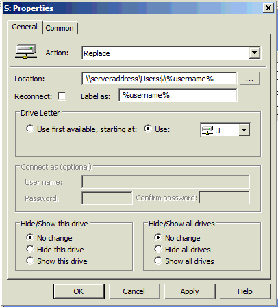
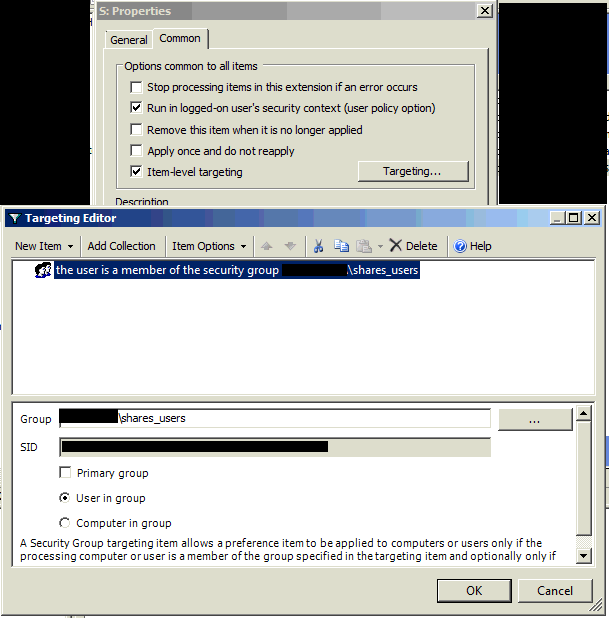

# Windows Create Users Share

This setup will configure shares that will be mounted every time a user logs into their account on the domain.

names, drive letter, and other specifics may be substituted, but this structure should be followed

1. in *AD*, create two groups
	* `shares_users`
	* `shares_users_management`
1. Add **all** users who will have a user folder to `shares_users`
1. Add only management level users who may have access to all other users' files to `shares_users_management`
1. in the location you want to store the shares, create a folder named `Users`
	1. Set the *NTFS permissions* of the folder to NOT inherit permissions from its parent (copy them and remove excess when given the option)
	1. You basically want to end up with:
		* *Authenticated Users* - `modify`
		* *SYSTEM* `Full Control`
		* *shares\_users\_management* `modify`
		* *Administrators* `Full Control`
	1. Then set to replace child permissions
1. share the folder as `Users$` with both groups created previously using the `Advanced Sharing` interface
	* `shares_users` give read/write
	* `shares_users_management` give full control
1. create a folder in the *Users* folder for each user named after their win2000 username (`%username%`)
	1. on each folder, grant that user with `modify` ntfs permissions
1. Create an additional folder called `!management` with another folder inside called `!old users`
	* *!management* is intended for space for the members of *shares\_users\_management* to store a shared collection of files
	* *!old users* is intended as a place for us to move terminated users folders for management to decide how to deal with it from there, shifting our liability for data management
1. Create group policy drive mount object for everyone with the following guidelines:
	* 
	* 
1. Create an additional group policy drive mount for *shares\_users\_management* that mounts to the *Users$* share so they can access all folders within, following similar guidelines set in the previous images

###### Note:
* if Active Directory has login scripts running to mount drives as well, you need to make sure the script **doesn't** use `net use * \d` at all! Scripts run after group policy and therefore will simply disconnect the drive you just connected!
